# Dragonfly v2.3.0 is released!

Dragonfly v2.3.0 is released! 🎉🎉🎉 Thanks the [contributors](https://github.com/dragonflyoss/dragonfly/graphs/contributors) who made this release happend and welcome you to visit [d7y.io](https://d7y.io) website.


## Features

### Persistent Cache Task

It designs to provide persistent caching for tasks. This tool can import file and export file in P2P network. The solution is specifically engineered for high-speed read and write operations. This makes it particularly advantageous for scenarios involving large files, such as machine learning model checkpoints, where rapid, reliable access and distribution across the network are critical for training and inference workflows. By leveraging P2P distribution and persistent caching, dfcache significantly reduces I/O bottlenecks and accelerates the lifecycle of large data assets.

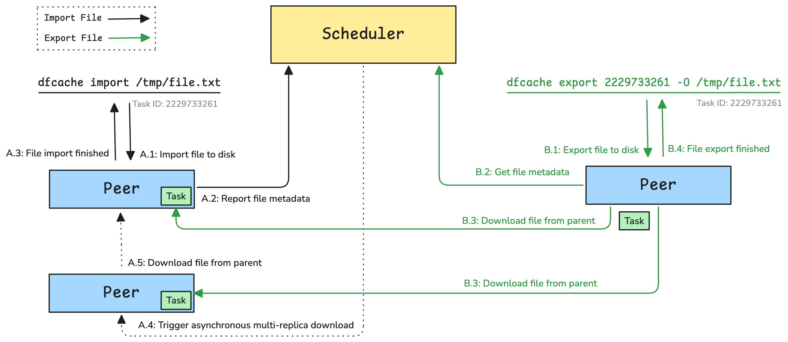

For documentation on how to use the dfcache command-line tool, please refer to the following link: <https://d7y.io/docs/next/reference/commands/client/dfcache/>

```shell
$ dfcache import /tmp/file.txt
⣷ Done: 2229733261
```

```shell
$ dfcache export 2229733261 -O /tmp/file.txt
```

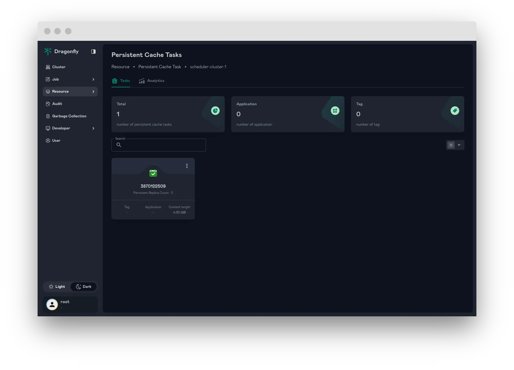

### Resource Search (Tasks and Persistent Cache Tasks)

The Resource Search feature enables seamless querying of tasks, including files, images, and persistent cache tasks. It optimizes resource access, improving task management and retrieval efficiency.

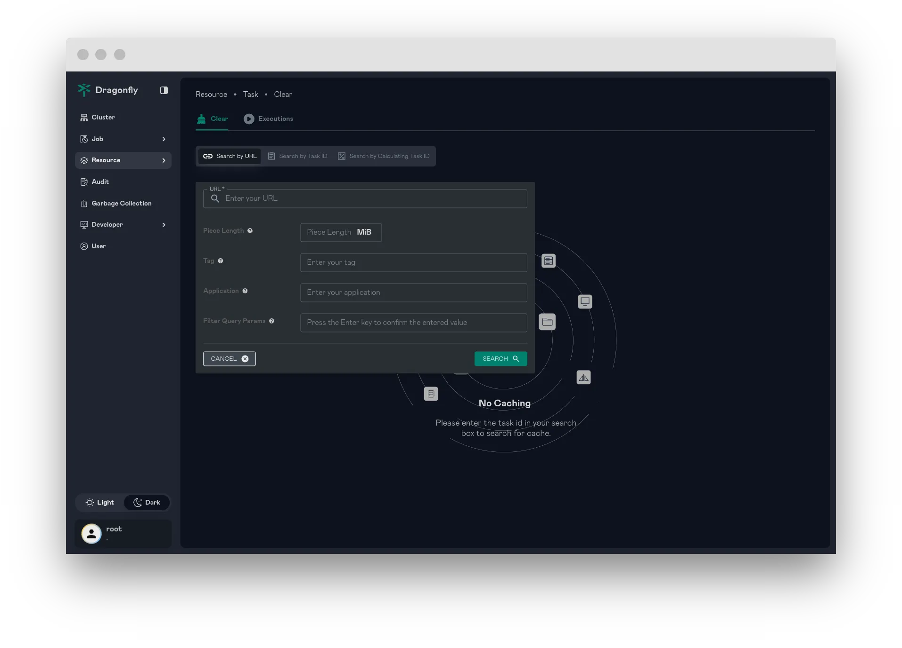

### Vortex: A P2P File Transfer Protocol Based on TLV

Vortex protocol is a high-performance peer-to-peer (P2P) file transfer protocol implementation in Rust, designed as part of the Dragonfly project. It utilizes the TLV (Tag-Length-Value) format for efficient and flexible data transmission, making it ideal for large-scale file distribution scenarios.
Packet Format:

- Packet Identifier (8 bits): Uniquely identifies each packet
- Tag (8 bits): Specifies data type in value field
- Length (32 bits): Indicates Value field length, up to 4 GiB
- Value (variable): Actual data content, maximum 1 GiB
  Protocol Format:

```text
-------------------------------------------------------------------------------------------------
|                            |                   |                    |                         |
| Packet Identifier (8 bits) |    Tag (8 bits)   |  Length (32 bits)  |   Value (up to 4 GiB)   |
|                            |                   |                    |                         |
-------------------------------------------------------------------------------------------------
```

For more information, please refer to the [Vortex Protocol](https://github.com/dragonflyoss/vortex/blob/main/docs/README.md).

### Enhanced Large File Distribution

This release significantly enhances Dragonfly's large file distribution capabilities, delivering improved efficiency and performance. We've revamped our scheduling algorithms for large file scenarios to ensure smarter resource and task allocation. Additionally, new mechanisms now more effectively balance the load across peers during large file transfers. Optimizations to the peer-to-peer (P2P) protocol and network transport layers further boost transmission efficiency.

These improvements include performance optimizations for both [Client](https://github.com/dragonflyoss/client) and [Scheduler](https://github.com/dragonflyoss/dragonfly). You can find more details in the project's pull request.

### Support scopes for Personal Access Tokens (PATs)

By enabling users to define specific access rights (scopes) for each PAT, we significantly enhance the security of Open API interactions. Instead of granting broad permissions, PATs can now be limited to only the necessary privileges required for a particular integration or task.

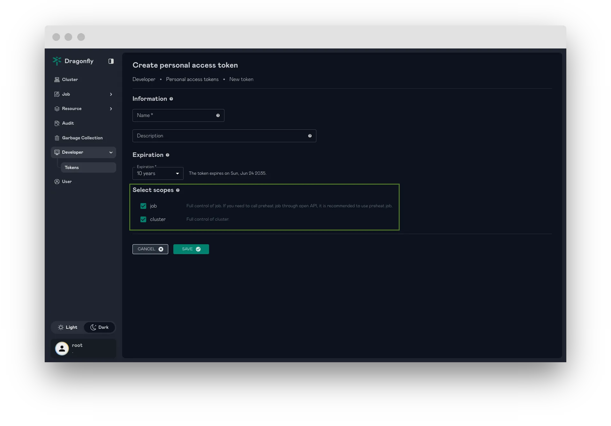

### Enhanced Preheating

#### Implement Distributed Rate Limiting for Preheating Tasks

By limiting the rate at which preheating requests are initiated across the distributed system, it prevents excessive preheating activities from stressing the origin. This enhancement ensures a more stable preheating.

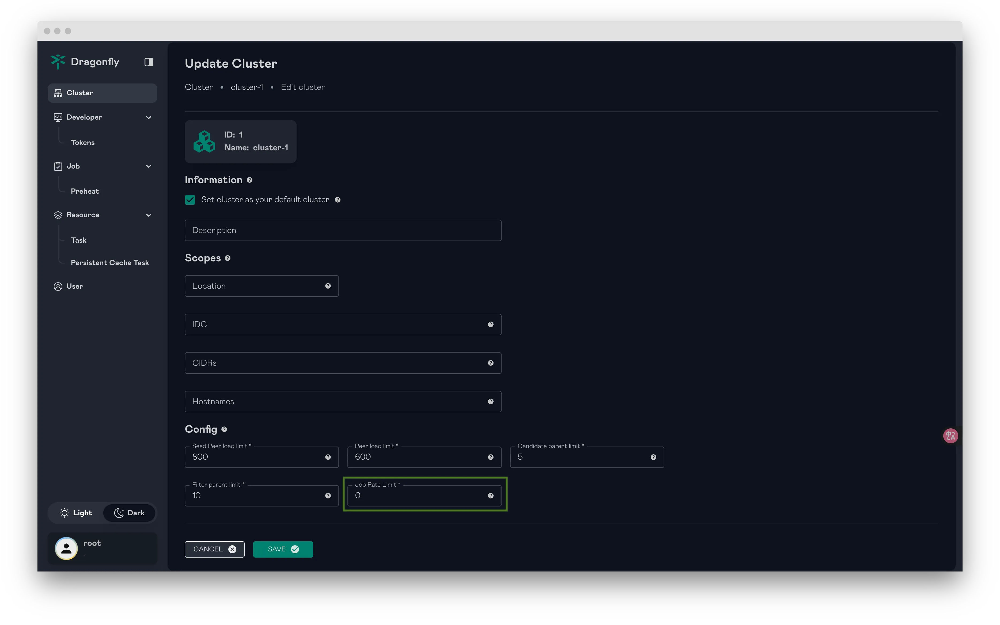

#### Support to set piece length for preheating

By allowing adjustment of the piece size, users can optimize data transfer efficiency, particularly in scenarios involving large files.

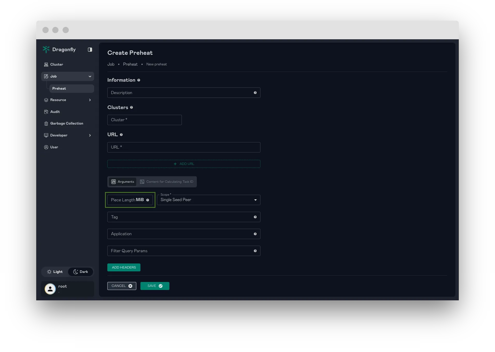

#### Flexible Preheating: Set Peer scope by Percentage or Count

This feature enhances preheating capabilities by allowing users to specify the preheating scope more precisely.

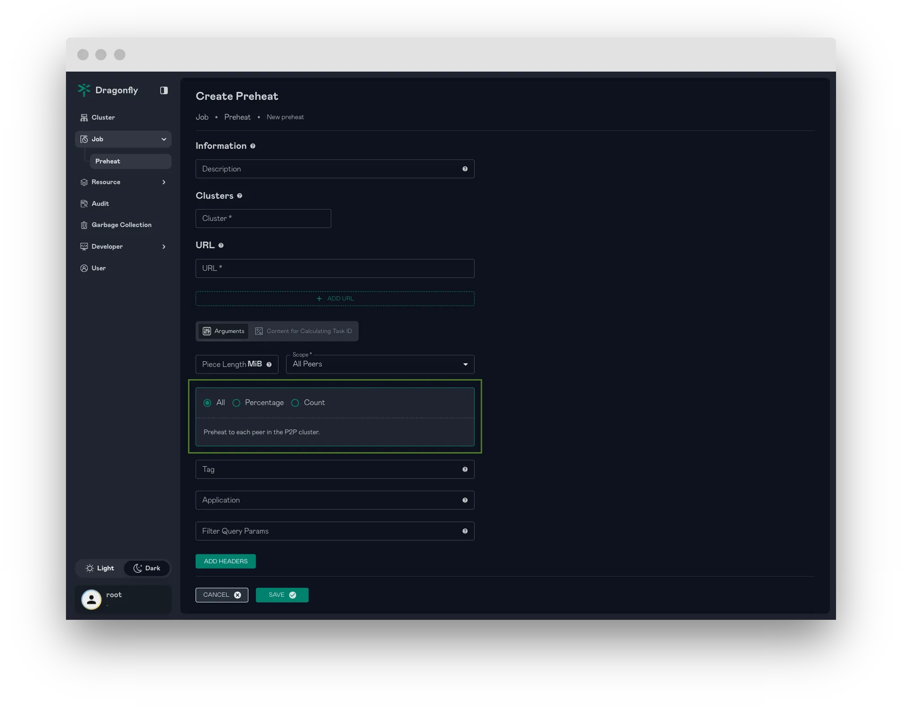

### Implement Audit Logging for User Operations

This feature introduces comprehensive audit logging capabilities to track user operations within the system. Audit logs will record critical actions performed by users, such as initiating preheating tasks, deleting task caches, and other significant system interactions.

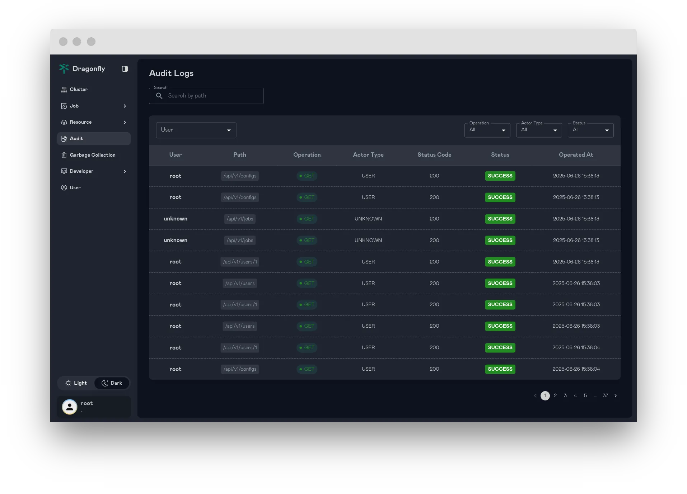

### Garbage Collection

Dragonfly supports Garbage Collection (GC) Audit Logs and GC Job Records to track and manage garbage collection activities. The Manager enables automated GC retention, allowing records to be preserved for a configurable time period. Additionally, it provides the capability to manually trigger forced GC operations as needed.

This feature ensures efficient monitoring and management of GC processes, offering flexibility through automated retention policies and manual intervention for immediate GC execution.

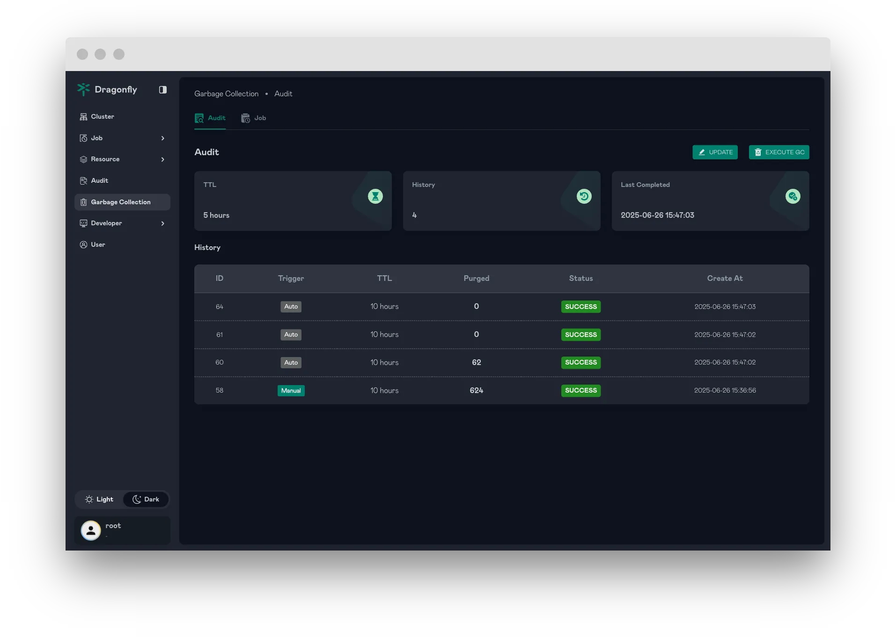

### Optimized File Download with Hard Link

File download needs to be done in a way that is efficient and secure. If users are downloading a large file, it is not efficient to download the file and copy to the output path. Instead, we can create a hard link to the file and send the link to the user. This way, we can avoid copying the file and save time and resources. If hard link fails (e.g. due to different file systems), dfdaemon will fallback to copying the file.
For more information, please refer to the [file download workflow](https://github.com/dragonflyoss/design/blob/main/systems-analysis/file-download-workflow-with-hard-link/README.md).

### Hardware Acceleration for Piece Hash Computation

This feature enables hardware-accelerated Piece hash computation, significantly boosting performance and efficiency. By utilizing specialized hardware, the hash computation process is accelerated, allowing faster processing of large file.

### Advanced Storage Management

#### Disk Space Validation for Operations

This feature enhances the client's storage functionality by implementing disk space validation. When insufficient disk space is detected, the client will return a failure response, preventing potential data corruption or incomplete operations.

#### Disk Garbage Collection Management

This feature enhances Peer's disk management by introducing configurable garbage collection (GC) thresholds based on disk usage. The distThreshold parameter allows users to define a specific disk capacity (e.g., 10TiB) as the base for calculating GC trigger points. If set, the distHighThresholdPercent (e.g., 80%) and distLowThresholdPercent (e.g., 60%) are applied relative to this capacity. If distThreshold is not provided or set to 0, these percentages are calculated based on the total actual disk space. When disk usage exceeds the high threshold, Dragonfly triggers GC(LRU) to reclaim space; GC stops when usage falls below the low threshold. This enables efficient management of a logical disk portion for caching, improving resource utilization and system performance.

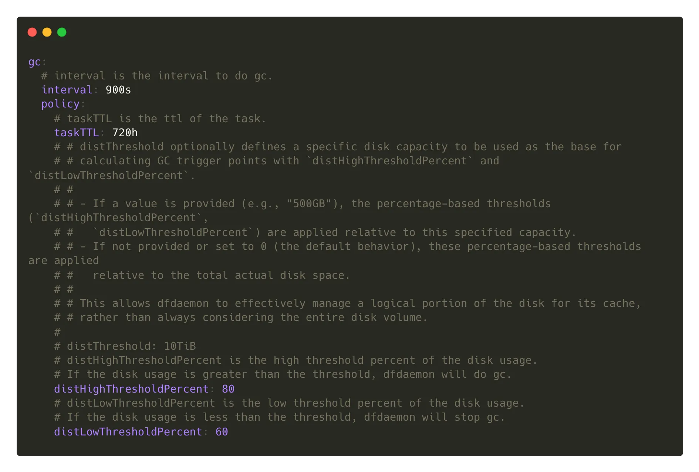

### Support for OpenTelemetry Tracing

Dragonfly supports for tracing based on OpenTelemetry, covering the Manager, Scheduler, and Peers. This enables end-to-end visibility into the download process, allowing users to query detailed information, such as overall download latency, using a specific task ID. The integration ensures efficient monitoring and performance analysis across the entire system.

Add tracing configuration as follows(in Manager, Scheduler and Peer):

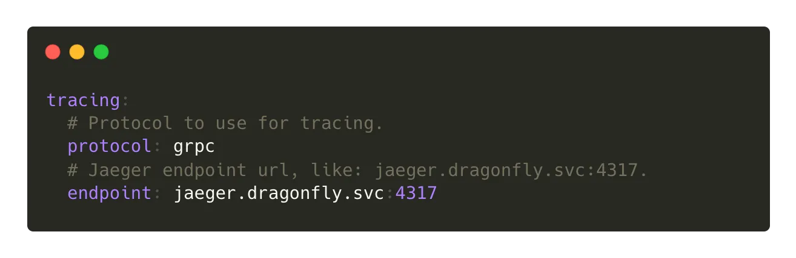

You can access the Jaeger UI to visualize the traces.

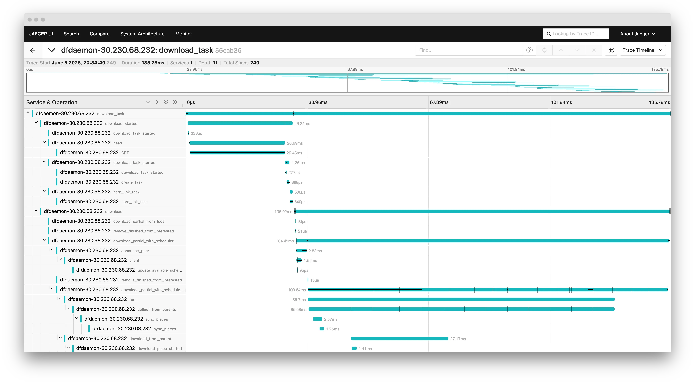

For more information, please refer to the [Tracing](https://d7y.io/docs/next/operations/best-practices/observability/tracing/).

## Security Enhancements

We extend our sincere gratitude to the [CNCF TAG Security](https://tag-security.cncf.io/) for their collaboration on a joint security audit. Their expertise and thorough review were invaluable in helping us identify areas for security improvement within Dragonfly.
For detailed information on the specific security issues addressed and the corresponding fixes, please refer to the following issue: <https://github.com/dragonflyoss/dragonfly/issues/3811>

## Nydus

### New features and enhancements
- nydusify copy: support chunked upload and retry mechanisms to handle large image blobs.
- nydusify check: refactor to support OCI v1 and nydus format images as both source and target.
- nydusd: support chunk-level CRC data validation for image data consistency.

## Significant bug fixes

- Fixed memory leaks and file descriptor leaks caused by `sysinfo` library.
- Cleans up the Unix domain socket (UDS) to prevent dfdaemon startup crashes.
- Prevent client from repeatedly downloading the same piece from multiple parents.

## Others

You can see [CHANGELOG](https://github.com/dragonflyoss/dragonfly/blob/main/CHANGELOG.md) for more details.

## Links

- Dragonfly Website: <https://d7y.io/>
- Dragonfly Repository: <https://github.com/dragonflyoss/dragonfly>
- Dragonfly Client Repository: <https://github.com/dragonflyoss/client>
- Dragonfly Console Repository: <https://github.com/dragonflyoss/console>
- Dragonfly Charts Repository: <https://github.com/dragonflyoss/helm-charts>
- Dragonfly Monitor Repository: <https://github.com/dragonflyoss/monitoring>

## Dragonfly Github


