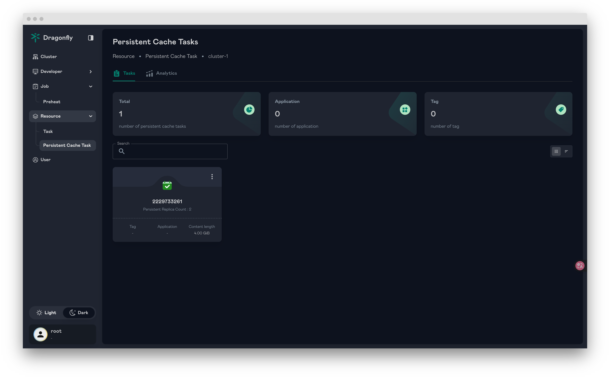
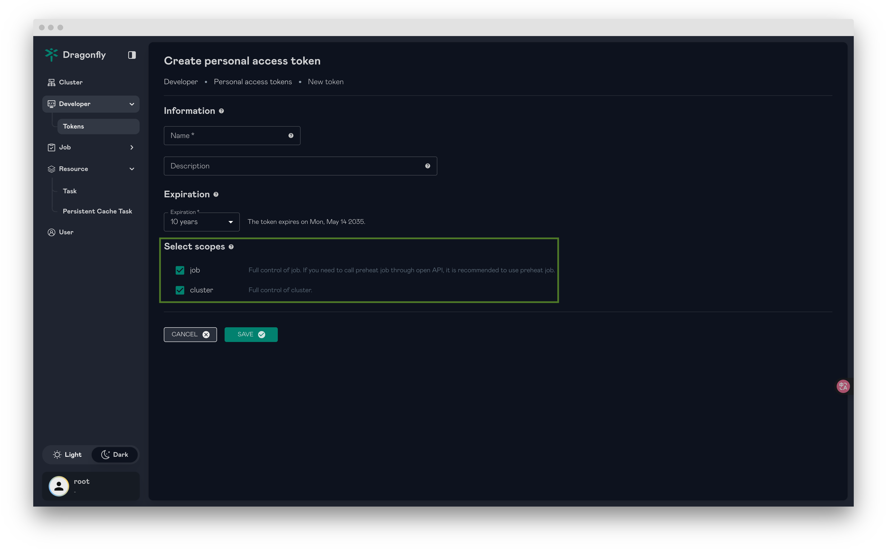
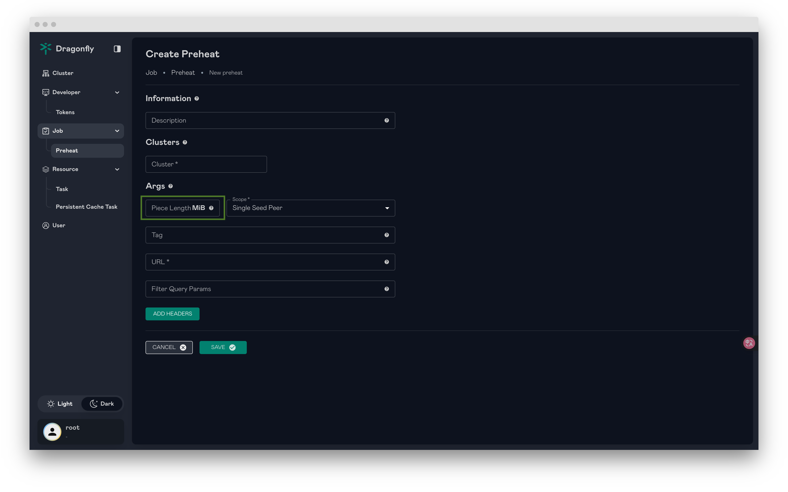
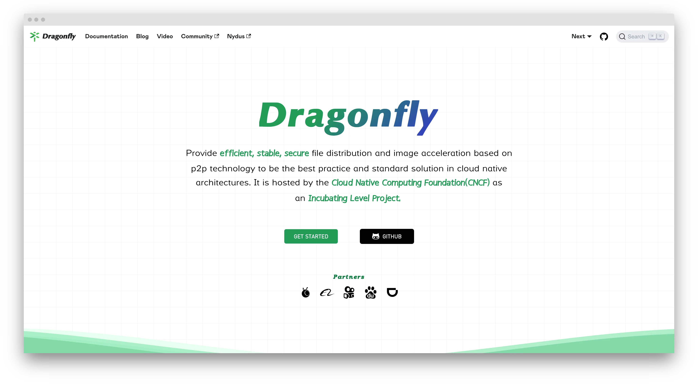

# Pre-Announcement: Dragonfly v2.3.0 Coming Soon!

We're excited to announce that Dragonfly v2.3.0 is scheduled for release at the end of June! 🎉🎉🎉

This upcoming release is packed with new features and improvements, made possible by our dedicated community of [contributors](https://github.com/dragonflyoss/dragonfly/graphs/contributors). A huge thank you to everyone who has played a part in making Dragonfly better!


## Features

### Persistent Cache Task

It designs to provide persistent caching for tasks. This tool can import file and export file in P2P network. The solution is specifically engineered for high-speed read and write operations. This makes it particularly advantageous for scenarios involving large files, such as machine learning model checkpoints, where rapid, reliable access and distribution across the network are critical for training and inference workflows. By leveraging P2P distribution and persistent caching, dfcache significantly reduces I/O bottlenecks and accelerates the lifecycle of large data assets.

```shell
$ dfcache import /tmp/file.txt
⣷ Done: 2229733261
```

```shell
$ dfcache export 2229733261 -O /tmp/file.txt
```


For documentation on how to use the dfcache command-line tool, please refer to the following link: <https://d7y.io/docs/next/reference/commands/client/dfcache/>

### Vortex: A P2P File Transfer Protocol Based on TLV

Vortex protocol is a high-performance peer-to-peer (P2P) file transfer protocol implementation in Rust, designed as part of the Dragonfly project. It utilizes the TLV (Tag-Length-Value) format for efficient and flexible data transmission, making it ideal for large-scale file distribution scenarios.
Packet Format:

- Packet Identifier (8 bits): Uniquely identifies each packet
- Tag (8 bits): Specifies data type in value field
- Length (32 bits): Indicates Value field length, up to 4 GiB
- Value (variable): Actual data content, maximum 1 GiB
  Protocol Format:

```text
-------------------------------------------------------------------------------------------------
|                            |                   |                    |                         |
| Packet Identifier (8 bits) |    Tag (8 bits)   |  Length (32 bits)  |   Value (up to 4 GiB)   |
|                            |                   |                    |                         |
-------------------------------------------------------------------------------------------------
```

For more information, please refer to the [Vortex Protocol](https://github.com/dragonflyoss/vortex/blob/main/docs/README.md).

### Enhanced Large File Distribution

This release significantly enhances Dragonfly's large file distribution capabilities, delivering improved efficiency and performance. We've revamped our scheduling algorithms for large file scenarios to ensure smarter resource and task allocation. Additionally, new mechanisms now more effectively balance the load across peers during large file transfers. Optimizations to the peer-to-peer (P2P) protocol and network transport layers further boost transmission efficiency.

### Support scopes for Personal Access Tokens (PATs)

By enabling users to define specific access rights (scopes) for each PAT, we significantly enhance the security of Open API interactions. Instead of granting broad permissions, PATs can now be limited to only the necessary privileges required for a particular integration or task.


### Enhanced Preheating

#### Implement Distributed Rate Limiting for Preheating Tasks

By limiting the rate at which preheating requests are initiated across the distributed system, it prevents excessive preheating activities from stressing the origin. This enhancement ensures a more stable preheating.


#### Support to set piece length for preheating

By allowing adjustment of the piece size, users can optimize data transfer efficiency, particularly in scenarios involving large files.


#### Support preheating tasks to memory

By loading data into memory during the preheating, subsequent access requests can be served directly from the memory cache.

```text
     Preheat
        |
        |
+--------------------------------------------------+
|       |              Peer                        |
|       |                   +-----------+          |
|       |     -- Partial -->|   Cache   |          |
|       |     |             +-----------+          |
|       v     |                |    |              |
|   Download  |              Miss   |              |
|     Task -->|                |    --- Hit ------>|<-- Download
|             |                |               ^   |
|             |                v               |   |
|             |          +-----------+         |   |
|             -- Full -->|   Disk    |----------   |
|                        +-----------+             |
|                                                  |
+--------------------------------------------------+
```

#### Flexible Preheating: Set Peer scope by Percentage or Count

This feature enhances preheating capabilities by allowing users to specify the preheating scope more precisely.

### Implement Audit Logging for User Operations

This feature introduces comprehensive audit logging capabilities to track user operations within the system. Audit logs will record critical actions performed by users, such as initiating preheating tasks, deleting task caches, and other significant system interactions.

## Security Enhancements

We extend our sincere gratitude to the [CNCF TAG Security](https://tag-security.cncf.io/) for their collaboration on a joint security audit. Their expertise and thorough review were invaluable in helping us identify areas for security improvement within Dragonfly.
For detailed information on the specific security issues addressed and the corresponding fixes, please refer to the following issue: <https://github.com/dragonflyoss/dragonfly/issues/3811>

## Document

Refactor the website documentation to make Dragonfly simpler and more practical for users, refer to [d7y.io](https://d7y.io/).


## Links

- Dragonfly Website: <https://d7y.io/>
- Dragonfly Repository: <https://github.com/dragonflyoss/dragonfly>
- Dragonfly Client Repository: <https://github.com/dragonflyoss/client>
- Dragonfly Console Repository: <https://github.com/dragonflyoss/console>
- Dragonfly Charts Repository: <https://github.com/dragonflyoss/helm-charts>
- Dragonfly Monitor Repository: <https://github.com/dragonflyoss/monitoring>

## Dragonfly Github


