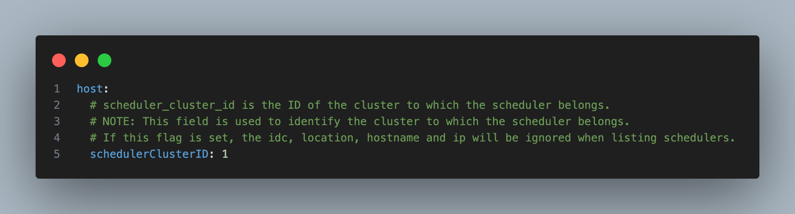

# Dragonfly v2.4.0 发布了

Dragonfly v2.4.0 发布了！🎉🎉🎉 感谢为此版本做出贡献的[贡献者们](https://github.com/dragonflyoss/dragonfly/graphs/contributors)，欢迎访问 [d7y.io](https://d7y.io) 网站。

## 新增特性

### 负载感知调度算法

调度算法升级为一种两阶段调度算法，结合中央调度与节点级二次调度，基于实时负载感知来优化 P2P 下载性能。

更多信息，请参阅 [Scheduling](https://d7y.io/docs/next/operations/deployment/applications/scheduler/#scheduling)。

### Vortex 协议支持 P2P 文件传输

Dragonfly 提供了基于 TLV 的新型 Vortex 传输协议，以提升 P2P 下载性能。使用 TLV（Tag-Length-Value）格式作为轻量级协议，替代 gRPC 进行节点间的数据传输。
与 gRPC 相比，基于 TCP 的 Vortex 可将大文件下载时间减少 50%，基于 QUIC 的 Vortex 可减少 40%，两者都能有效降低峰值内存使用。

更多信息，请参阅 [TCP Protocol Support for P2P File Transfer](https://github.com/dragonflyoss/design/blob/main/systems-analysis/tcp-protocol/tcp-protocol.md) 和 [QUIC Protocol Support for P2P File Transfer](https://github.com/dragonflyoss/design/blob/main/systems-analysis/quic-protocol/quic-protocol.md)。

### Rust Request SDK

### 指定集群 ID 实现多集群 Kubernetes 简化部署

Dragonfly 支持一种简化功能，用于部署和管理多个 Kubernetes 集群，方法是为每个集群显式分配一个 `schedulerClusterID`。
这种方式允许用户直接控制集群亲和性，而无需依赖基于位置的调度元数据，例如 IDC、主机名或 IP 地址。

使用此功能，每个 Peer、Seed Peer 和 Scheduler 都通过明确定义的 Scheduler Cluster ID 来确定其目标调度器集群。
这确保了集群之间的精确隔离以及可预测的跨集群行为。

更多信息，请参阅 [Create Dragonfly Cluster Simple](https://d7y.io/docs/next/getting-started/quick-start/multi-cluster-kubernetes/#create-dragonfly-cluster-simple)。

### Manager 和 Scheduler 组件的性能和资源优化

增强了 Manager 和 Scheduler 组件的性能和资源利用率，同时显著降低了 CPU 和内存开销，提升了系统效率和资源管理能力。

### 增强预热功能

- 支持预热到指定节点：采用基于优先级的选择逻辑，其中 IP 指定具有最高优先级，其次是基于数量的选择，最后是基于百分比的选择。

- 支持在单个预热任务中预热多个 URL。

- 支持通过 Scheduler gRPC 接口预热文件和镜像。

### 基于镜像 Blob SHA256 计算 ID 以避免重复下载

客户端现已支持直接根据镜像 Blob 的 SHA256 哈希值计算任务 ID，而不再使用下载 URL。此增强功能可以防止当同一 Blob 从不同镜像仓库
域名访问时产生的重复下载和数据冗余问题，新版本默认启用此功能。

### 缓存 HTTP 307 重定向 URL

新增对 HTTP 307（临时重定向）响应 URL 的缓存支持，以优化 Dragonfly 的多分片下载性能。当下载 URL 被拆分为多个分片时，
重定向目标地址现在会被缓存，从而消除冗余的重定向请求并降低延迟。

### Go 客户端已弃用，并由 Rust 客户端取代

Go 客户端已被弃用，并由 [Rust 客户端](https://github.com/dragonflyoss/client) 取代。未来所有的开发和维护工作将专注于 Rust 客户端，它提供了更好的性能、稳定性和可靠性。

更多信息，请参阅 [dragoflyoss/client](https://github.com/dragonflyoss/client)。

### 附加功能增强

- 在 Rust 客户端中启用 ARM64 架构的 64K 页面大小支持。
- 修复 dfget 版本输出中缺失的 git commit 元数据问题。
- 支持 containerd V3 配置中 `io.containerd.cri.v1.images` 插件的 `config_path` 配置。
- 在 `reqwest` 中使用 `hickory-dns` 替换 `glibc DNS` 解析器，以实现 DNS 缓存并防止分片下载过程中过多的 DNS 查询。
- 支持 `--include-files` 配置参数，可选择性地从目录中下载文件。
- 添加 `--no-progress` 配置参数，可禁用下载进度条输出。
- 支持 `backend` 操作中的自定义请求头，为 HTTP 请求提供灵活的请求头配置。
- 重构日志输出，减少冗余日志记录并提高日志可读性。

## 重要修复

- 将数据库字段类型从 `text` 修改为 `longtext`，以支持存储预热任务的信息。
- 修复了 Scheduler 关闭期间重复停止 Seed Peer 服务时导致的 panic 问题。
- 修复了在指定 Redis 密码但未设置用户名时，Broker 认证失败的问题。

## Nydus

### 新增特性

- Nydusd：为 RAFS V5 和 V6 格式添加运行时 CRC32 校验支持，增强数据完整性验证。
- Nydusd：支持在 Nydusd 恢复过程中重新发送 FUSE 请求，提高进程恢复的可靠性。
- Nydusd：增强 VFS 状态保存机制，用于进程热升级和故障转移。
- Nydusify：支持 Nydus 到 OCI 的反向转换能力（实验性功能），支持无缝迁移回 OCI 格式。
- Nydusify：实现镜像拷贝时零磁盘传输，显著减少复制操作期间对本地磁盘的使用。
- Snapshotter：将 `blob.meta` 打包到 Bootstrap 中，提高 RAFS V6 镜像的 Blob 下载时的可靠性

### 重要修复

- Nydusd：修复镜像仓库认证中 `access_token` 字段的认证令牌获取问题。
- Nydusd：为 umount API 添加了递归的 inode/dentry 失效处理。
- Nydus Image：修复 optimize 子命令中的多个问题，并添加后端配置支持。
- Snapshotter：为代理模式实现延迟父快照恢复，修复父快照缺失问题。

## 其他

您可以在 [CHANGELOG](https://github.com/dragonflyoss/dragonfly/blob/main/CHANGELOG.md) 中查看更多详细信息。

## 链接

- Dragonfly 网站：<https://d7y.io/>
- Dragonfly 仓库：<https://github.com/dragonflyoss/dragonfly>
- Dragonfly 客户端仓库：<https://github.com/dragonflyoss/client>
- Dragonfly 控制台仓库：<https://github.com/dragonflyoss/console>
- Dragonfly Charts 仓库：<https://github.com/dragonflyoss/helm-charts>
- Dragonfly 监控仓库：<https://github.com/dragonflyoss/monitoring>

## Dragonfly Github

