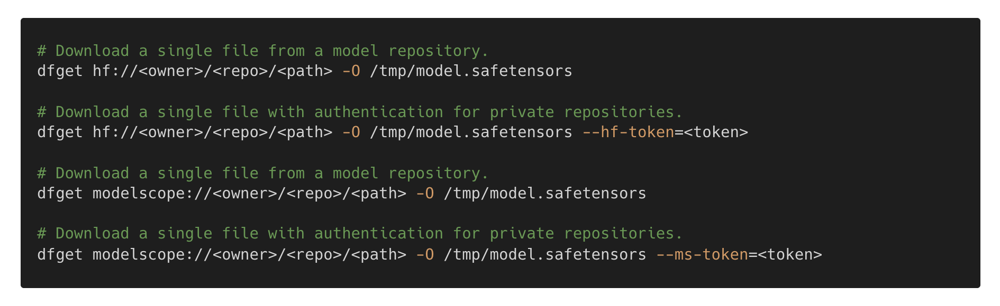
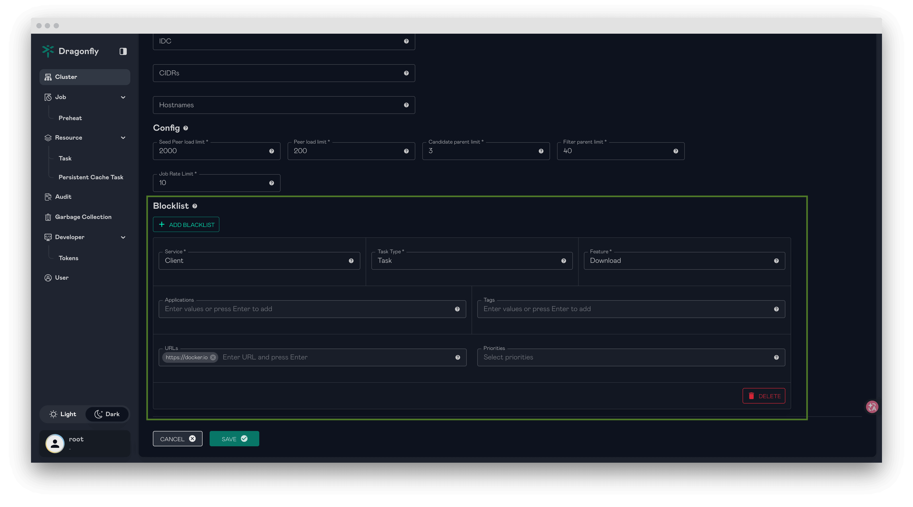

# Dragonfly v2.5.0 is released

Dragonfly v2.5.0 is released!🎉🎉🎉 Thanks to the [contributors](https://github.com/dragonflyoss/dragonfly/graphs/contributors) who made this release happen and welcome you to visit [d7y.io](https://d7y.io) website.

## New features and enhancements

### Direct Repository Downloads from Hugging Face and ModelScope

Dragonfly Client now supports directly downloading model repositories from Hugging Face and ModelScope. Users can run commands such as `dfget hf://deepseek-ai/DeepSeek-OCR` and `dfget modelscope://models/deepseek-ai/DeepSeek-OCR` to fetch repositories.
Git LFS data is downloaded through Dragonfly P2P acceleration, while other repository metadata is fetched through the Git protocol.

For more information, please refer to [Hugging Face repository download](https://github.com/dragonflyoss/dragonfly/issues/4419) and [ModelScope repository download](https://github.com/dragonflyoss/dragonfly/issues/4420).

### Dragonfly Injector for Kubernetes Webhook Injection

Dragonfly provides [dragonfly-injector](https://github.com/dragonflyoss/dragonfly-injector), a Kubernetes Mutating Admission Webhook for automatic P2P capability injection.
It can inject Dragonfly client binaries and configurations, dfdaemon socket mounts, and CLI tools into application Pods through annotation-based policies, enabling Pods to use Dragonfly for file downloads without rebuilding container images.
Helm Charts now also support deploying Dragonfly with webhook injection enabled.

For more details, please refer to [Using Dragonfly with webhook injection](https://d7y.io/docs/next/getting-started/installation/helm-charts/#using-dragonfly-with-webhook-injection).

### Blocklist for Download Control

Dragonfly supports configuring a blocklist in the Manager console to disable specific downloads.
This can be used as an emergency measure to mitigate the impact of sudden abnormal requests on the service.
When a blocked download is intercepted, gRPC downloads return a `PermissionDenied` error code, and HTTP proxy downloads return a `FORBIDDEN` status.

For more information, please refer to [Blocklist](https://d7y.io/docs/next/advanced-guides/blocklist/).

### Comprehensive Rate Limiting

Dragonfly introduces more complete rate limiting capabilities across the control plane and client.
Manager and Scheduler gRPC servers now support a configurable request rate limit for unary requests and streaming connections.
The client supports outbound bandwidth, inbound bandwidth, back-to-source bandwidth, prefetch bandwidth, upload request, download request, and adaptive rate limiting to better protect source services and improve system stability under high load.

For more information, please refer to [Rate Limit](https://d7y.io/docs/next/advanced-guides/rate-limit/).

### dfctl Command Line Tool

Dragonfly Client introduces `dfctl`, a command-line tool used to manage tasks in the client's local storage, including tasks, persistent tasks, and persistent cache tasks.
It supports listing and removing local resources, and can preheat file and image tasks through the Scheduler.

For more information, please refer to [dfctl](https://d7y.io/docs/next/reference/commands/client/dfctl/).

### Container Registry Proxy Configuration Simplification

dfdaemon can now infer the upstream registry from the `ns` query parameter appended by containerd registry mirror requests.
Combined with `proxyAllRegistries: true`, users can route all registries through Dragonfly with a single `_default/hosts.toml` configuration instead of maintaining separate registry-specific `hosts.toml` files and `X-Dragonfly-Registry` headers.

For more information, please refer to [Infer upstream registry from containerd ns query parameter](https://github.com/dragonflyoss/client/issues/1791) and [proxyAllRegistries documentation update](https://github.com/dragonflyoss/d7y.io/pull/410).

### Client Download and Transfer Optimization

Dragonfly Client improves download efficiency and file transfer reliability in multiple areas.
The parent selector and piece collector now coordinate more closely to collect enough parent peers before scheduling decisions, improving bandwidth utilization while keeping graceful fallback for unstable parent peers.
File export and download operations now use buffered writes, and gRPC stream buffer sizes and connection settings have been tuned for better large-file transfer performance.

### HTTP Handling and Redirect Security Improvements

The HTTP backend now uses HTTP/1.1 and improves stat request handling by retrying with a `HEAD` request when a response has `Transfer-Encoding` but no `Content-Length`.
Dragonfly also strips sensitive headers such as `Authorization` and `Cookie` when following cross-origin redirects, and avoids caching relative HTTP 307 redirect locations while still resolving them correctly during request processing.

### Additional Enhancements

- Add ExternalRedis TLS support in Manager, including CA certificate, client certificate, key, and `insecureSkipVerify` options.
- Remove deprecated V1 preheat API endpoints and consolidate health checks to the `/healthy` endpoint.
- Improve upload and download metrics collection and remove unused gRPC piece download logic.
- Improve `INSTANCE_NAME` generation by using Kubernetes build-time environment variables and falling back to the system hostname.
- Add dfdaemon `hickory_dns` options to make DNS resolver behavior configurable.
- Improve task ID calculation for OCI registry blob downloads to reduce redundant downloads and storage across registries.

## Significant bug fixes

- Fixed the Redis Lua script argument order for peer TTL and `concurrent_piece_count`, preventing unintended key expiration and incorrect peer state.
- Fixed PostgreSQL `SERIAL` sequence handling after seeding default Scheduler Cluster and Seed Peer Cluster records, avoiding primary key conflicts when creating new clusters.
- Fixed relative HTTP 307 redirect handling by skipping cache for relative `Location` values and resolving them against the base URL before following redirects.

## Nydus

### New features and enhancements

- Support building prefetch-optimized layer blobs for Ondemand data.
- Support converting Nydus images to OCI format and converting to/from local archives.
- Support zero-disk transfer in Nydusify Copy.
- Introduce uffd-based support for the virtio-pmem DAX backend to enable high-performance on-demand image loading in Kata scenarios.
- Support switching the Storage layer from Proxy mode to Dragonfly SDK mode to improve P2P cache hit performance.
- Support committing with short container IDs and synchronizing the filesystem before commit.
- Support resending FUSE requests when recovering Nydusd, fixing hot-upgrade tests.

### Significant bug fixes

- Fix Blobfs compatibility with fuse-backend-rs 0.12.0.
- Fix failover-policy parameter parsing.
- Fix a panic in Builder when a symbolic link overwrites a directory.
- Fix multiple issues in chunkdict deduplication logic, DBSCAN clustering, and chunk sorting.
- Fix Nydus image detection logic.
- Fix remount invalidation for nested mount points in fusedev.
- Fix abnormal values when Nydusctl backend metric counters are reset.
- Fix Nydusify failing to find blobs when image names are modified.
- Fix plain HTTP conversion in Nydusify.

## Others

You can see [CHANGELOG](https://github.com/dragonflyoss/dragonfly/blob/main/CHANGELOG.md) for more details.

## Links

- Dragonfly Website: <https://d7y.io/>
- Dragonfly Repository: <https://github.com/dragonflyoss/dragonfly>
- Dragonfly Client Repository: <https://github.com/dragonflyoss/client>
- Dragonfly Injector Repository: <https://github.com/dragonflyoss/dragonfly-injector>
- Dragonfly Console Repository: <https://github.com/dragonflyoss/console>
- Dragonfly Charts Repository: <https://github.com/dragonflyoss/helm-charts>
- Dragonfly Monitor Repository: <https://github.com/dragonflyoss/monitoring>

## Dragonfly Github

